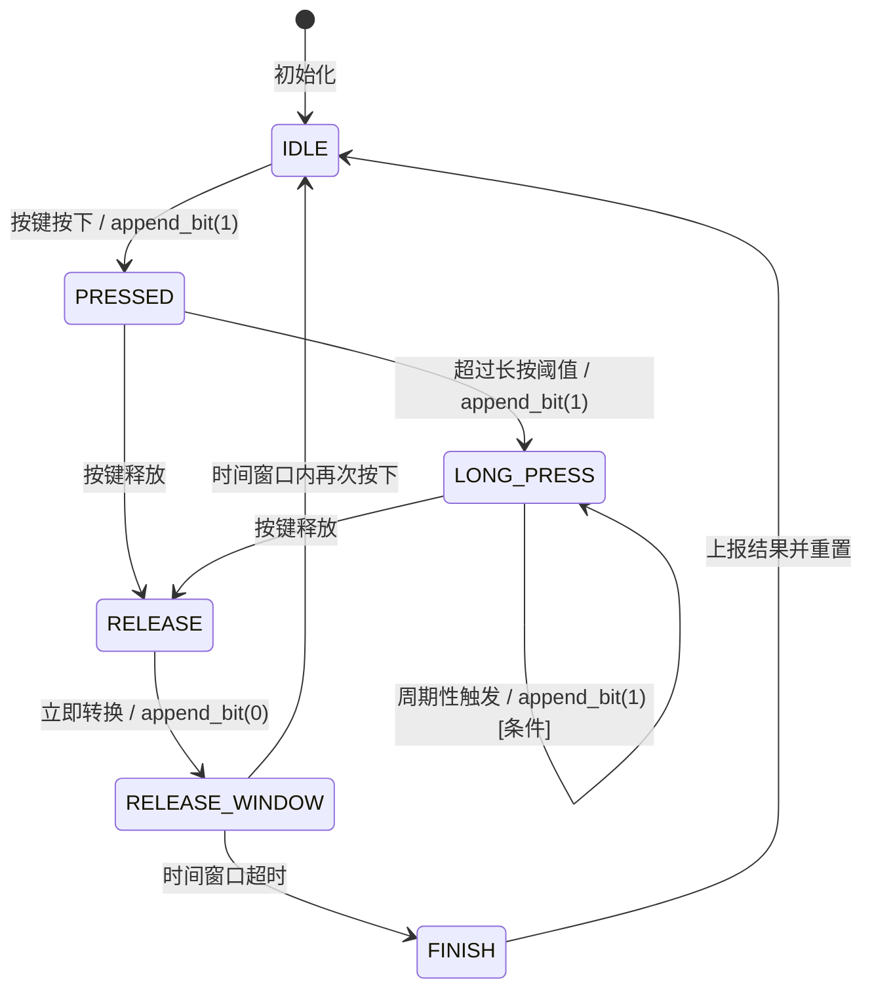

# BitsButton 状态机迁移流程图

## 状态迁移图（Mermaid格式）



## 详细状态转换条件（修正版）

### 1. IDLE → PRESSED
- **触发条件**: 检测到按键按下（btn_pressed == 1）
- **执行动作**: 
  - `__append_bit(&button->state_bits, 1)`
  - 记录进入时间 `state_entry_time = current_time`
  - 上报 PRESSED 事件

### 2. PRESSED → LONG_PRESS
- **触发条件**: `time_diff * BITS_BTN_TICKS_INTERVAL > long_press_start_time_ms`
- **执行动作**:
  - `__append_bit(&button->state_bits, 1)`
  - 重置进入时间 `state_entry_time = current_time`
  - 重置周期计数器 `long_press_period_trigger_cnt = 0`
  - 上报 LONG_PRESS 事件

### 3. PRESSED → RELEASE
- **触发条件**: 检测到按键释放（btn_pressed == 0）
- **执行动作**: 
  - 仅状态转换 `current_state = BTN_STATE_RELEASE`
  - **不重置** state_entry_time（保持原有时间）
  - **不执行** 位操作（位操作在 RELEASE 状态内执行）

### 4. LONG_PRESS → LONG_PRESS（自循环）
- **触发条件**: `time_diff * BITS_BTN_TICKS_INTERVAL > long_press_period_triger_ms`
- **执行动作**:
  - 重置进入时间 `state_entry_time = current_time`
  - 增加周期计数器 `long_press_period_trigger_cnt++`
  - **条件性追加位**: 仅当 `__check_if_the_bits_match(&state_bits, 0b011, 3)` 为真时
    - `__append_bit(&button->state_bits, 1)`
  - 上报周期性 LONG_PRESS 事件（包含周期计数）

### 5. LONG_PRESS → RELEASE
- **触发条件**: 检测到按键释放（btn_pressed == 0）
- **执行动作**: 
  - 重置周期计数器 `long_press_period_trigger_cnt = 0`
  - 仅状态转换 `current_state = BTN_STATE_RELEASE`
  - **不重置** state_entry_time（保持原有时间）

### 6. RELEASE → RELEASE_WINDOW
- **触发条件**: 自动转换（在 RELEASE 状态内立即执行）
- **执行动作**:
  - `__append_bit(&button->state_bits, 0)`
  - 重置进入时间 `state_entry_time = current_time`
  - 上报 RELEASE 事件
  - 立即转换状态 `current_state = BTN_STATE_RELEASE_WINDOW`

### 7. RELEASE_WINDOW → IDLE
- **触发条件**: 时间窗口内检测到按键再次按下（btn_pressed == 1）
- **执行动作**: 
  - 重置进入时间 `state_entry_time = current_time`
  - 状态转换 `current_state = BTN_STATE_IDLE`
  - **保持** state_bits（继续积累按键序列）

### 8. RELEASE_WINDOW → FINISH
- **触发条件**: `time_diff * BITS_BTN_TICKS_INTERVAL > time_window_time_ms`
- **执行动作**: 
  - 状态转换 `current_state = BTN_STATE_FINISH`
  - **不执行** 其他操作（在下一状态处理）

### 9. FINISH → IDLE
- **触发条件**: 自动转换（在 FINISH 状态内立即执行）
- **执行动作**:
  - 上报 FINISH 事件（包含完整的 state_bits）
  - 清零状态位 `button->state_bits = 0`
  - 状态转换 `current_state = BTN_STATE_IDLE`

## 时序特征

### 时间参数（默认值）
- **BITS_BTN_TICKS_INTERVAL**: 5ms（状态机驱动周期）
- **BITS_BTN_DEBOUNCE_TIME_MS**: 40ms（去抖时间）
- **BITS_BTN_LONG_PRESS_START_TIME_MS**: 1000ms（长按检测阈值）
- **BITS_BTN_LONG_PRESS_PERIOD_TRIGER_MS**: 1000ms（长按周期间隔）
- **BITS_BTN_TIME_WINDOW_TIME_MS**: 300ms（多击检测窗口）

### 二进制位序列示例

#### 单击操作
```
时序: 按下(100ms) → 释放 → 等待(300ms)
位序列: 1 → 0
最终编码: 0b010
```

#### 双击操作
```
时序: 按下(100ms) → 释放 → 按下(100ms) → 释放 → 等待(300ms)
位序列: 1 → 0 → 1 → 0
最终编码: 0b01010
```

#### 长按操作
```
时序: 按下(1200ms持续) → 释放 → 等待(300ms)
位序列: 1 → 1(长按检测) → 0
最终编码: 0b0110
```

#### 单击后长按
```
时序: 按下(100ms) → 释放 → 按下(1200ms持续) → 释放 → 等待(300ms)
位序列: 1 → 0 → 1 → 1(长按检测) → 0
最终编码: 0b010110
```

## 关键设计特点

1. **位操作的优雅性**: 使用移位和或运算简洁地记录按键时序
2. **模式匹配的高效性**: 通过位掩码快速识别按键模式
3. **时间窗口机制**: 巧妙区分单击、双击、多击等复杂操作
4. **事件驱动架构**: 支持回调和缓冲区两种事件处理方式
5. **可扩展性**: 支持组合按键，具备按键抑制机制